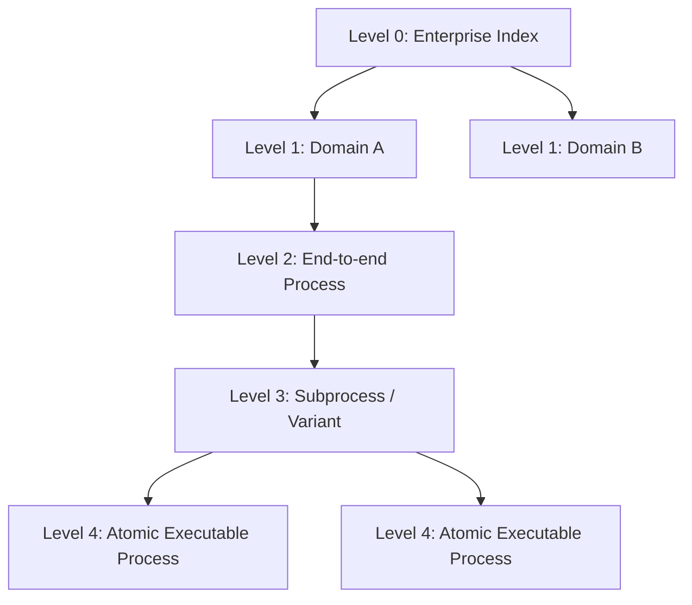

# Level Composition

## Purpose
Levels 1–3 provide composition and governance without duplicating executable content.

## Composition includes
A package manifest MAY specify:

- `includes`: list of package references (relative paths within workspace OR stable package IDs)

### Reference forms
A reference MUST be one of:
- `../relative/path/to/package`
- `package:<id>@<semver-range>`

Examples:
- `../processes/L4-invoice-validation`
- `package:uapf.proc.invoice.validation@^1.0.0`

## No duplication rule (normative)
If a Level 2 package includes a Level 4 package, the Level 2 package MUST NOT copy the Level 4 BPMN/DMN/CMMN artifacts into its own folders.
Any repository structure that duplicates BPMN/DMN/CMMN files across Levels for the same artifact identity is **non-conformant**.

Instead, Level 2 uses `includes` and provides:
- additional metadata/governance,
- additional resource bindings,
- higher-level documentation and traceability.

## Composition diagram (informative visual, still normative structure)

## Non-conformance rules (normative)

The following conditions are NON-CONFORMANT:

- Duplicating BPMN, DMN, or CMMN artifacts across multiple Levels for the same logical process identity.
- Copying Level-4 executable artifacts into Level 1–3 packages instead of referencing them.
- Creating multiple divergent definitions of the same process without distinct package identifiers.

A conformant implementation MUST detect and reject such structures when validating a workspace.
